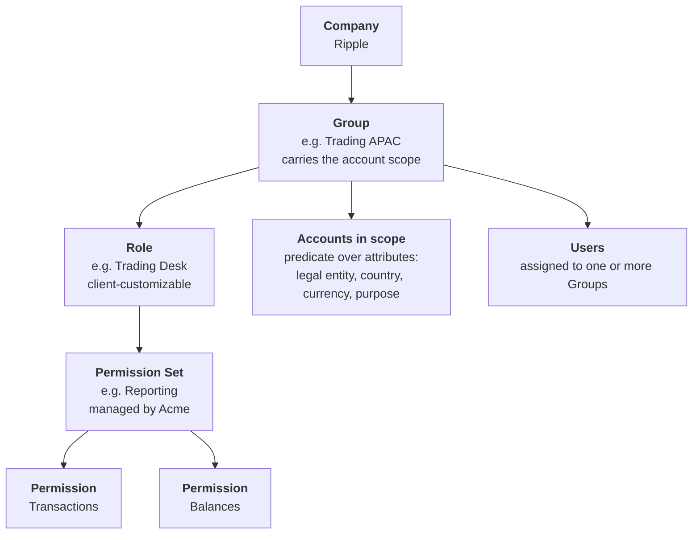

# Organization background

Background for the redesign of the account group, user group, role and permission set hierarchy.

* This document records the client's organization, the access hierarchy, and the eight teams that will be modelled as Roles.
* The mockup implements the ACME-2178 catalogue. Where this document and the ticket differ, the ticket wins in the code. See what the mockup reflects.
* Related tickets are ACME-2177 (flat accounts and grouping) and ACME-2178 (RBAC catalogue, presets, account group scoping).

## Who is who

* Acme is the platform. Acme defines the permission catalogue and the permission sets.
* Ripple is the client. Ripple holds multiple legal entities under one company.
* The client group is the top layer. Accounts sit flat under it, per ACME-2177.

## Hierarchy



The same shape without mermaid:

```
Company (Ripple)
└── Group  ......................  defines account access, grants roles, holds users
    ├── Role  ..................  narrows the permission sets. Client-customizable
    │   └── Permission Set  ....  managed by Acme
    │       └── Permission  ....  managed by Acme
    ├── Accounts in scope  .....  a predicate over account attributes
    └── Users  .................  a user can be in several groups
```

Reading the chart:

* A **Group** carries the account scope. It grants one or more Roles and holds Users. The scope sits here because this is the only layer where users, roles and accounts meet.
* A **Role** narrows the permission sets. Each organization works differently, so roles are the customizable layer.
* A **Permission Set** and its **Permissions** are managed by Acme. Clients do not author them.
* **Accounts** are described by attributes, not by position in a tree. The attributes are legal entity, bank, country, currency and purpose.
* A **User** is assigned to one or more Groups, and holds no permission of their own.

There is no account-group layer. A group scopes onto accounts directly.

## What the eight teams need

Each story below is recorded as supplied, followed by what it demands of the model.

| # | Story | Capability it needs | Accounts it needs |
| --- | --- | --- | --- |
| 1 | As a member of the payment operations team, I need access to the portal to create a new payment. | Create payment orders | All accounts of their legal entity |
| 2 | As a member of the recon team, I need access to the portal to read the balances and transactions data for data analysis. | Read transactions and balances | All accounts |
| 3 | As a member of the treasury team, I need access to the portal to perform my daily treasury operations. | Read transactions and balances, create payment orders | All accounts |
| 4 | As a member of the fiat team, I need access to the portal to sign incoming transactions and my outgoing payments real time. | Approve payments | All accounts |
| 5 | As a member of the trading APAC team, I need access to the portal to sight the payments my traders made and the payments send to my traders. | Read payments | OTC accounts denominated in SGD |
| 6 | As a member of the trading US team, I need access to the portal to sight the payments my traders made and the payments send to my traders. | Read payments | OTC accounts in the US |
| 7 | As the financial controller, I need access to the portal to review payments before cut off. | Approve payments | All accounts |
| 8 | As a member of the customer service team, I should only have access to the review certain payments details and add comment when requested by the payment ops team. | Read payment details, write comments | All accounts |

Three patterns fall out of the eight.

* Stories 5 and 6 are the same job over different accounts. One role, two scopes.
* Stories 4 and 7 are different jobs over the same capability. Two roles, one permission set.
* Stories 2 and 3 differ by exactly one capability, creating a payment order.

## Why four layers

Each layer exists because something changes at a different time and is owned by a different party.

| Layer | Owner | Changes when | Answers |
| --- | --- | --- | --- |
| Permission | Acme | Acme ships an endpoint | What can the API check? |
| Permission Set | Acme | Acme groups capabilities that only work together | What is a coherent capability? |
| Role | Client | The client reorganizes | What do we call this job? |
| Group | Client | People join or leave, or accounts are added | Who does this job, on which accounts? |

The test for whether the layers earn their place is the number of edits a change costs.

* Acme adds a cancel-payment capability. One edit to the Payments permission set. Every role, group and user that already had Payments inherits it.
* The client renames Payment Operations to Payment Control. One edit to the role. No permission changes.
* Trading US opens a second OTC account. Zero edits, because the group scopes on account attributes rather than a list of account IDs.
* A new starter joins the recon team. One edit to the group membership.

Collapsing any two layers moves an edit onto the wrong party.

* Without permission sets, the client assembles raw permissions. Every client invents a different combination, and half of them are broken. Approving a payment you cannot read is not a usable grant.
* Without roles, the group holds the sets directly. Stories 4 and 7 then look identical in the audit trail, even though the FIAT team and the financial controller are answerable for different things.
* Without groups, the scope has to live on the role. Stories 5 and 6 then become two roles that must be kept in step forever.

## Where the account constraint sits

The constraint sits on the **Group**, and only on the Group.

* Not on the Permission or the Permission Set. Those are Acme's vocabulary, shared across every client. A scope on them would make them client data.
* Not on the Role. A scoped role has to be duplicated per scope, which is the story 5 and story 6 problem.
* Not on the User. One flat scope per user cannot express a user who approves for one entity and only reads for another.

The Group is the only layer where users, roles and accounts all meet, so it is the only place a scope can apply to a specific pairing of people and capabilities.

### How access resolves

A user's access is a set of pairs, one per group membership, not two independent lists.

```
effective access = union over the user's groups of
                   ( permissions of that group's roles  ×  accounts in that group's scope )
```

The permission and the account must be resolved together, inside one group. Never union the permissions across groups and then union the accounts.

Worked example. A user belongs to two groups.

| Group | Role | Permission set | Accounts in scope |
| --- | --- | --- | --- |
| Payment Ops APAC | Payment Operations | Payments | Legal entity AMA |
| Trading US | Trading Desk | Reporting | OTC accounts in the US |

* Resolved correctly, the user creates payment orders on AMA accounts and reads only on the US OTC accounts.
* Resolved the wrong way, the permissions union to create plus read and the accounts union to AMA plus US OTC, so the user can create payment orders on the US OTC accounts. Nobody granted that.

That wrong-way union is the bug the group-level scope prevents, and it is exactly the case where one user holds a different role for each entity.

### When two groups overlap on one account

Permissions add up for that account. The most permissive grant wins, per account.

* A user who is in Payment Ops APAC and in Financial Control can both create and approve on an AMA account. That is intended.
* Stopping that user approving their own payment order is a maker-checker rule, not a permission. Role-based access answers whether a person may ever do X on account Y. Segregation of duties answers whether they may do X on this particular payment. Keep the two separate.

### Set level or group level

Modern Treasury puts the account constraint on the permission set itself, as a set-wide "Only Include" and "And Exclude" list. That works for them and not for us, and the reason is ownership rather than taste.

* Their permission sets are authored by the client, so the set is already client data and an account list belongs to it.
* Our permission sets are managed by Acme and shared across clients, which is what lets Acme add a capability to Payments once and have every client inherit it. A shared set cannot carry one client's account numbers.

The two choices are a package. Client-authored sets allow a set-level scope. Acme-managed sets force a group-level scope.

| | Constraint on the permission set | Constraint on the group |
| --- | --- | --- |
| What it means | This bundle only ever applies to these accounts | These people exercise this bundle on these accounts |
| Reuse | The same capabilities on another account set means cloning the set | One set reused by many groups |
| Count to maintain | sets multiplied by scopes | sets stay fixed, groups multiply |
| Editing scope | Touches the object that also defines capabilities | Touches the group only |
| A new account opens | Re-open every set that should see it | Nothing, if the scope is a predicate |

One thing is worth taking from their design. A constraint that is intrinsic to a capability belongs on the set, for example that Payment Support may touch payment orders and never counterparties. A constraint that is extrinsic, meaning which accounts this team looks after, belongs on the group. If both layers ever carry a constraint, the effective account list is the intersection, and an exclusion beats an inclusion.

### What "limit on the account level" can mean

Three different things get called the same name. Two are needed and one is not.

| Meaning | Needed |
| --- | --- |
| A grant applies to a set of accounts | Yes. Stories 1, 5 and 6 cannot be built without it |
| One person holds different capabilities on different accounts | Yes. See the decision below |
| An admin ticks permissions account by account in the UI | No. That is one row of state per account per permission, and it goes stale |

The first two are delivered by a group-level predicate scope. The third is what that avoids.

### Decision: the maker and checker split is account level

Payment Ops can be maker on some accounts and checker on others, and a person may hold both on one specific account. That is a permission difference per account, so the model carries it rather than pushing it into a policy.

What follows from the decision:

* Create and approve must stay in separate permission sets. Payments carries Payment Orders. Approvals carries Payment Approvals. They are never bundled.
* A team that does both is modelled as two groups, one per function, each with its own account scope. A person joins both where they hold both.
* Group count grows with team multiplied by function rather than team alone. Groups are cheap because they define no capability, so this is the intended place for the growth.
* Name a group after its team, its function and its book, for example `Payment Ops APAC · Maker`. Without that the group list stops being readable once it passes twenty rows.

The decision does not remove the four-eyes rule. Wherever create and approve land on the same person and the same account, something still has to stop them approving their own payment order. That check is per payment, not per account, so it stays a policy on top of the permission model.

* Access control answers whether this person may ever approve on this account.
* The four-eyes rule answers whether this person may approve this particular payment.

Both are required under this decision. Only the second would have been required under a single combined Payments set.

### The scope has to be a predicate, not a list

Today a group scopes with `ALL`, `LEGAL_ENTITY` or a hand-picked account list. Stories 5 and 6 need neither of the first two and should not use the third, because a hand-picked list goes stale the day a new OTC account opens.

The scope should be a filter over account attributes, which is consistent with the flat account model in ACME-2177.

| Story | Scope predicate |
| --- | --- |
| 1 | `legalEntity = AMA` |
| 5 | `purpose = OTC AND currency = SGD` |
| 6 | `purpose = OTC AND country = US` |

An explicit account list stays available as an escape hatch for the cases no attribute describes.

## Legal entities

Acme holds four legal entities. The names and codes below are recorded exactly as supplied. See the open questions for two that need confirming.

| Legal entity | Code |
| --- | --- |
| Acme Markets APAC | AMA |
| Acme Labs Cayman | ALKY |
| Acme Markets Delaware | AMDE |
| Acme Markets Middle East | AMEA |

## The configuration

This catalogue is derived from the eight stories above. It supersedes the earlier six-role list.

### Permissions

Managed by Acme. One permission is one capability the API can check.

| Permission | Grants |
| --- | --- |
| All | Everything, including group and role administration |
| Transactions | Read transactions |
| Balances | Read balances |
| Payment Orders | Read and create payment orders |
| Payment Orders Edit | Amend a payment order someone else raised |
| Payment Approvals | Approve or reject a payment order |
| Comments | Write a comment on a payment order |

Balances and Comments are new. See the open questions.

### Permission sets

Managed by Acme. A set bundles the permissions that are only useful together.

| Permission set | Permissions | Serves |
| --- | --- | --- |
| Administrator | All | Administrators |
| Reporting | Transactions, Balances | Stories 2, 5, 6 |
| Payments | Transactions, Balances, Payment Orders | Stories 1, 3 |
| Approvals | Transactions, Balances, Payment Approvals | Stories 4, 7 |
| Payment Support | Transactions, Payment Orders Edit, Comments | Story 8 |

### Roles

A role names a job in this organization and composes Acme's sets. Customizable per client.

| Role | Permission set | From story |
| --- | --- | --- |
| Administrator | Administrator | Existing |
| Payment Operations | Payments | 1 |
| Payment Approver | Approvals | 1, the checker half |
| Reconciliation | Reporting | 2 |
| Treasury | Payments | 3 |
| FIAT Signer | Approvals | 4 |
| Trading Desk | Reporting | 5 and 6 |
| Financial Controller | Approvals | 7 |
| Customer Support | Payment Support | 8 |

Two pairs prove the layers are independent.

* Trading Desk is one role used by two groups, because the job is the same and only the accounts differ.
* FIAT Signer and Financial Controller are two roles on one permission set, because the capability is the same and only the accountability differs.

### Groups

A group grants roles, holds users and carries the account scope.

| Group | Role | Accounts in scope |
| --- | --- | --- |
| Administrators | Administrator | All |
| Payment Ops APAC · Maker | Payment Operations | `legalEntity = AMA` |
| Payment Ops APAC · Checker | Payment Approver | `legalEntity = AMA AND purpose != OTC` |
| Reconciliation | Reconciliation | All |
| Treasury | Treasury | All |
| FIAT Signers | FIAT Signer | All |
| Trading APAC | Trading Desk | `purpose = OTC AND currency = SGD` |
| Trading US | Trading Desk | `purpose = OTC AND country = US` |
| Financial Control | Financial Controller | All |
| Customer Support | Customer Support | All |

The two Payment Ops groups are the decision above in practice. A member who is maker only joins the first. A member who checks as well joins both, and the checker scope names the accounts they are allowed to check.

Only the Administrator group may define groups and roles for a user.

### Users

A user is assigned to one or more groups. Account access and permissions both follow from that.

| User | Groups |
| --- | --- |
| Jx | Administrators, RMA Signers, RLKY Signers |
| Ming | Administrators |
| Nigel | RMA Signers |
| Cayter | Engineers |
| Benoit | Trading and Markets |

Jx is in both Signers groups, so Jx can sign for RMA and for RLKY. Nigel can sign for RMA only.

## Team functions

Background on the teams the roles are named after.

### Trading and Markets 

* Supports all internal FIAT operations automation, including trading pay-ins and payouts with external trading counterparties.
* Operations are time-sensitive.
* Make payment only from the OTC accounts.
* Payment volume is low. Payment values are high.
* Sole user of the maker-checker feature.

### Trading and Markets Recon team

* Sub-team of the above.
* Consumes transaction, balance and payment-read data only, for analysis and reconciliation.
* Data quality is the priority. The data must be accurate against the bank raw data.

### Payment Ops team

* Supported by the internal dashboard built by the Trading and Markets team.
* Has historically handled payment ops functions such as making payments from the bank portal and reconciling payment status.
* Time-sensitive.
* Should have visibility of all accounts of a given legal entity.
* Can be maker or checker for different accounts.

### Treasury team

* Runs the treasury management system that include treasury payments, reconciliation and daily and month end closing. 
* Ledger reconciliation, at daily close and at month end.

### FIAT and Zeus team

* Owns the FIAT function.
* Makes payments from all accounts.


## What the mockup reflects

Deployed: <https://portal-mockup-virid.vercel.app>

* The landing page is Transactions. The home page is removed for MVP.
* Payments is view only for MVP. Creating, retrying and approving a payment are not in this version.
* Payments shows only the settled statuses, COMPLETED and FAILED. The interim states are removed, so there is no pending, rejected by approver or approval expired.
* The account groups page is removed. A group scopes onto accounts directly.
* User Management carries the four tabs: Groups, Roles, Permission Sets, Users.
* Accounts is renamed from Internal Accounts. The main table shows bank, name, bank account number, legal entity and currencies. An account can hold several currencies.

The mockup now seeds the ACME-2178 catalogue, not the refined catalogue in this document. The two differ and the ticket wins in the code.

| | ACME-2178, now in the mockup | This document's refined catalogue |
| --- | --- | --- |
| Permissions | `transactions.view`, `payments.view/create/edit/delete/approve` | All, Transactions, Balances, Payment Orders, Payment Orders Edit, Payment Approvals, Comments |
| Permission sets | Operations, Finance, Administrator | Administrator, Reporting, Payments, Approvals, Payment Support |
| Roles | Administrator (seeded), Operation Manager, Finance Controller, Trading Desk | 9 roles |
| Groups | Administrators, Payment Operations APAC / US / EU, Trading and Markets, Finance and Treasury | 10 groups |
| Users | The ACME-2178 example: Ee Cheah, SW, Matt, Avril, Rick, Amrinder, FC | Jx, Ming, Nigel, Cayter, Benoit |

Fixture data added so the ticket's examples resolve to real accounts:

* A fifth legal entity, AMEU (Acme Markets Europe, NL), so Payment Operations (EU) has an account.
* Three accounts: OTC Trading SGD, OTC Trading USD and EUR Operating. Trading and Markets scopes onto the two OTC accounts by name.

### What building it exposed

Three places where ACME-2178 contradicts itself. The mockup follows the reading named below and the ticket needs a decision on each.

| Conflict | Where | What the mockup does |
| --- | --- | --- |
| Payment actions are create, view, edit, approve in §1 but View, Create, Delete, Edit in §2 | §1 model table against §2 catalogue | Carries all six: view, create, edit, delete and approve. Approve has to exist because §3b defines Administrator by excluding it |
| Administrator is "all by default" in §3 but "excludes Payment Approval" in §3b | §3 against §3b | Follows §3b. Administrator is every permission except `payments.approve` |
| Operations is `transactions` in §3 but the §4 tables show Operations users holding "transactions, payments" | §3 against §4 | Follows §3 for the set, and composes the Operation Manager role from Operations plus Finance so the effective permissions match §4 |

One structural gap, which is the important one:

* `payments` is a single feature and Finance holds all of it, so any role that can raise a payment order can also approve one. Operation Manager and Finance Controller both come out holding create and approve.
* That contradicts the decision above, which needs create and approve in separate sets.
* The MVP catalogue therefore cannot express maker and checker. It needs either a create-only payments set, or the ability for a set to select actions rather than a whole feature.
* The mockup surfaces this rather than hiding it. Any role holding both shows a `maker + checker` warning on the Roles tab and in the role sheet.

A second gap, smaller: there is no read-only payments set. A trading desk that should only sight payments has to be given the whole Finance set, which includes create, delete and approve, or nothing. Trading Desk is seeded with Operations only, so it currently sees transactions and no payments at all.

## Open questions

* Balances is needed by stories 2 and 3 and does not exist in the catalogue today.
* Comments is needed by story 8 and does not exist in the catalogue today.
* Story 8 asks for "certain payments details" only. Permissions are checked per endpoint, so a field level restriction is not expressible today. Either Acme defines a narrower payment summary permission, or customer support reads the full payment.
* Story 4 says "sign incoming transactions". Approving an incoming transaction is not a payment approval. Confirm whether this means releasing or acknowledging incoming funds.
* Story 7 says "before cut off" and story 4 says "real time". Both are service levels rather than permissions. Approval windows were removed from the MVP.
* Decided: the maker and checker split is account level, so create and approve stay in separate permission sets and a team that does both is two groups. The per-payment four-eyes rule is still required on top.
* An account needs a `purpose` attribute before OTC can be used in a scope. Currency and country also need to become scope dimensions. The mockup scopes Trading and Markets to two named OTC accounts as a stand-in.
* ACME-2178 needs a create-only payments set, or action-level selection inside a set, before maker and checker can be expressed. See what building it exposed above.
* The ACME-2178 example client is Ripple and the seeded users are @ripple.com, while the client group in the mockup is still Acme Group with Acme-named legal entities. Confirm which name the demo should carry.
