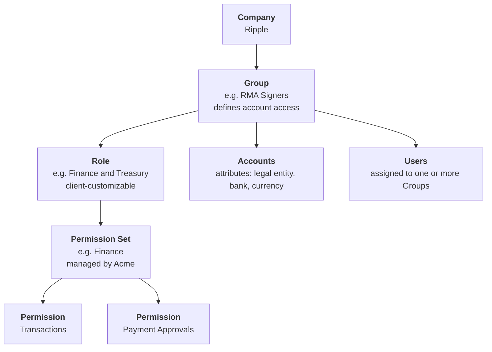

# Organization background

Background for the redesign of the account group, user group, role and permission set hierarchy.

* This document records the client's organization, the proposed hierarchy, and the six teams that will be modelled as Roles.
* It is background only. No code in this repo has changed to match it.
* Related tickets are ACME-2177 (flat accounts and grouping) and ACME-2178 (RBAC catalogue, presets, account group scoping).

## Who is who

* Acme is the platform. Acme defines the permission catalogue and the permission sets.
* Ripple is the client. Ripple holds multiple legal entities under one company.
* The client group is the top layer. Accounts sit flat under it, per ACME-2177.

## Hierarchy



The same shape without mermaid:

```
Company (Ripple)
└── Group  ......................  defines account access, grants roles, holds users
    ├── Role  ..................  narrows the permission sets. Client-customizable
    │   └── Permission Set  ....  managed by Acme
    │       └── Permission  ....  managed by Acme
    ├── Accounts in scope  .....  all, by legal entity, or hand-picked
    └── Users  .................  a user can be in several groups
```

Reading the chart:

* A **Group** defines account access. It grants one or more Roles and holds Users.
* A **Role** narrows the permission sets. Each organization works differently, so roles are the customizable layer.
* A **Permission Set** and its **Permissions** are managed by Acme. Clients do not author them.
* **Accounts** are described by attributes, not by position in a tree. The attributes are legal entity, bank and currency.
* A **User** is assigned to one or more Groups, and holds no permission of their own.

There is no account-group layer. A group scopes onto accounts directly.

## Legal entities

Acme holds four legal entities. The names and codes below are recorded exactly as supplied. See the open questions for two that need confirming.

| Legal entity | Code |
| --- | --- |
| Acme Markets APAC | AMA |
| Acme Labs Cayman | ALKY |
| Acme Markets Delaware | AMDE |
| Acme Markets Middle East | AMEA |

## The configuration

### Groups

A group defines account access, grants roles and holds users.

| Group | Role | Accounts in scope |
| --- | --- | --- |
| Administrators | Administrator | All |
| Trading and Markets | Operations | All |
| Trading and Markets Reconciliation | Reconciliation | All |
| Customer Support | Customer Support | All |
| Engineers | Engineering | All |
| RMA Signers | Finance and Treasury | RMA accounts |
| RLKY Signers | Finance and Treasury | RLKY accounts |

The two Signers groups are the same role over different account scopes. That is how one person signs for one entity and not another.
Only Administrator Group are allow to define the group and role for an user.

### Roles

A role narrows the permission sets for how this organization works. Roles are customizable per client.

| Role | Permission sets |
| --- | --- |
| Administrator | Administrator |
| Engineering | Engineer |
| Operations | Payments |
| Reconciliation | Recon Operations |
| Customer Support | Reviewer |
| Finance and Treasury | Finance |

### Permission sets and permissions

Managed by Acme.

| Permission set | Permissions |
| --- | --- |
| Administrator | All |
| Recon Operations | Transactions |
| Payments | Transactions, Payment Orders |
| Finance | Transactions, Payment Approvals |
| Reviewer | Payment Orders Edit |
| Engineer | Not yet specified |

### Users

A user is assigned to one or more groups. Account access and permissions both follow from that.

| User | Groups |
| --- | --- |
| Jx | Administrators, RMA Signers, RLKY Signers |
| Ming | Administrators |
| Nigel | RMA Signers |
| Cayter | Engineers |
| Benoit | Trading and Markets |

Jx is in both Signers groups, so Jx can sign for RMA and for RLKY. Nigel can sign for RMA only.

## Team functions

Background on the teams the roles are named after.

### Trading and Markets 

* Supports all internal FIAT operations automation, including trading pay-ins and payouts with external trading counterparties.
* Operations are time-sensitive.
* Make payment only from the OTC accounts.
* Payment volume is low. Payment values are high.
* Sole user of the maker-checker feature.

### Trading and Markets Recon team

* Sub-team of the above.
* Consumes transaction, balance and payment-read data only, for analysis and reconciliation.
* Data quality is the priority. The data must be accurate against the bank raw data.

### Payment Ops team

* Supported by the internal dashboard built by the Trading and Markets team.
* Has historically handled payment ops functions such as making payments from the bank portal and reconciling payment status.
* Time-sensitive.
* Should have visibility of all accounts of a given legal entity.
* Can be maker or checker for different accounts.

### Treasury team

* Runs the treasury management system that include treasury payments, reconciliation and daily and month end closing. 
* Ledger reconciliation, at daily close and at month end.

### FIAT and Zeus team

* Owns the FIAT function.
* Makes payments from all accounts.


## What the mockup reflects

Deployed: <https://portal-mockup-virid.vercel.app>

* The landing page is Transactions. The home page is removed for MVP.
* Payments is view only for MVP. Creating, retrying and approving a payment are not in this version.
* Payments shows only the settled statuses, COMPLETED and FAILED. The interim states are removed, so there is no pending, rejected by approver or approval expired.
* The account groups page is removed. A group scopes onto accounts directly.
* User Management carries the four tabs: Groups, Roles, Permission Sets, Users.
* The five groups, six roles, six permission sets and five users above are the seeded data.
