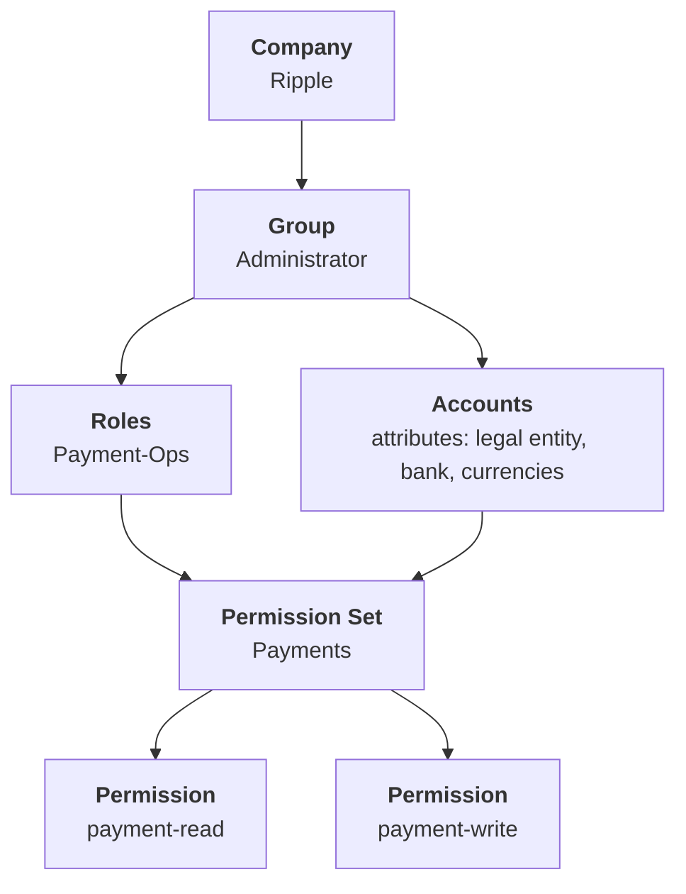

# Organization background

Background for the redesign of the account group, user group, role and permission set hierarchy.

* This document records the client's organization, the proposed hierarchy, and the six teams that will be modelled as Roles.
* It is background only. No code in this repo has changed to match it.
* Related tickets are ACME-2177 (flat accounts and grouping) and ACME-2178 (RBAC catalogue, presets, account group scoping).

## Who is who

* Acme is the platform. Acme defines the permission catalogue and the permission sets.
* Ripple is the client. Ripple holds multiple legal entities under one company.
* The client group is the top layer. Accounts sit flat under it, per ACME-2177.

## Proposed hierarchy



The same shape without mermaid:

```
Company (Ripple)
└── Group (Administrator)
    ├── Roles (Payment-Ops) ──┐
    │                         ├── Permission Set (Payments)
    └── Accounts ─────────────┘        ├── Permission (payment-read)
        attributes:                    └── Permission (payment-write)
          legal entity
          bank
          currencies
```

Reading the chart:

* A Company contains Groups.
* A Group contains Roles and Accounts.
* A Role and a set of Accounts together carry a Permission Set.
* A Permission Set is a bundle of individual Permissions.
* Accounts are described by attributes, not by position in a tree. The attributes are legal entity, bank and currencies.

## Legal entities

Ripple holds four legal entities. The names and codes below are recorded exactly as supplied. See the open questions for two that need confirming.

| Legal entity | Code |
| --- | --- |
| Ripple Markets APAC | AMA |
| Ripple Labs Cayman | AL |
| Ripple Markets Delaware | AMDE |
| Acme Markets Middle East | AMEL |

## Roles

Each team below becomes a Role.

### Trading and Markets (RTM team)

Function:

* Supports all internal FIAT operations automation, including trading operations such as pay-ins and payouts with external trading counterparties.
* Operations are time-sensitive.
* Payment volume is low. Payment values are high.
* Sole user of the maker-checker feature.
* Phased out H2H after migrating all their functions by integrating the Acme maker-checker key into their internal portal.
* One user holding the payment-checker role in one group can hold payment-maker in another group.

Access implications:

* Maker and checker must be assignable per group. They cannot be a property of the person.
* One person can hold maker in one group and checker in another at the same time.
* The four-eyes check must therefore be evaluated per payment, not per user.
* This team consumes maker-checker through a key on their own portal. Grants must apply to API keys, not only to dashboard users.

### Trading and Markets Recon team

Function:

* Sub-team of the above.
* Consumes transaction, balance and payment-read data only, for analysis and reconciliation.
* Data quality is the priority. The data must be accurate against the bank raw data.

Access implications:

* Needs a read-only Permission Set. The two presets in ACME-2178 do not include one.
* Needs statement and raw payload access so the team can compare Acme's output against the bank's raw data.
* No payment capability of any kind.

### Payment Ops team

Function:

* Supported by the internal dashboard built by the Trading and Markets team.
* Has historically handled payment ops functions such as making payments from the bank portal and reconciling payment status.
* Time-sensitive.
* Should have visibility of all accounts of a given legal entity.
* Can be maker or checker for different accounts.

Access implications:

* Entity-wide visibility matters. Scoping by legal entity tag is as important as scoping by a hand-built account group.
* Maker and checker vary by account, so the unit of a grant is a capability paired with an account scope.

### Ripple Treasury team

Function:

* Runs a treasury management system. Ripple acquired GTreasury in 2025 and uses GTreasury for the treasury function.
* Ledger reconciliation, at daily close and at month end.

Access implications:

* Consumes data through a system integration rather than the dashboard, so API key scoping applies.
* Needs balances and statements at close. Read only.

### FIAT and Zeus team

Function:

* Owns the FIAT function.
* Previously integrated Acme into Trovata. Ripple is now sunsetting the Trovata connection.
* Makes payments from all accounts.

Access implications:

* Needs payment creation across every account. This is the widest payment scope of any role here.
* A scope of "all accounts" must stay correct as new accounts are onboarded. A legal entity tag rule or an explicit all-accounts scope handles this. A hand-picked account group does not.

### Payment Product team

Function:

* Works on Ripple core product features such as Ripple Pay.
* In discussion on a virtual account API for an MXN bank.
* May need access to API key management, webhook retriggering, and cross-checking the API response against what Acme presents.

Access implications:

* Needs `api_key.manage` and `webhook.manage`.
* ACME-2178 defers both and hard-codes API keys and webhooks to administrator.
* Under that decision this team can only be served by granting the administrator set, which also grants `approval_policy.manage`. That is more privilege than the team's function requires.

## What this changes against the shipped model

The mockup currently implements ACME-2178 as written. The proposed chart differs in three ways.

* Roles return as a layer. ACME-2178 removed roles and granted permission sets directly. The chart puts Roles between the Group and the Permission Set.
* The chart shows no user or person node. Where a user attaches, and whether a user joins a Group or a Role, is undefined.
* Accounts carry "currencies" as a plural attribute. Each account in the current model carries exactly one currency.

## Open questions

* The brief opens with "Acme group has multiple legal entities", but every entity listed is a Ripple entity and the chart names the Company as Ripple. Confirm that Ripple is the client and Acme is the platform.
* "Acme Markets Middle East (AMEL)" is the only Acme-named entity in a Ripple list. Confirm whether this should read Ripple Markets Middle East.
* The codes AMA, AL and AMDE do not match ACME-2177, which uses RMA, RMDE and RLKY for Ripple entities. Confirm which set is canonical before either is built.
* Confirm whether a Permission Set attaches to a Role, to a Role paired with an account scope, or to a user.
* Confirm whether Group means the administrative boundary for a set of Roles, or the account group that scopes visibility. The chart uses "Group (Administrator)", which reads as the former.
* Two of the six Roles need read-only access and one needs API key and webhook management. Neither is expressible with the current presets. Confirm whether the preset catalogue expands, or whether these Roles are served another way.
